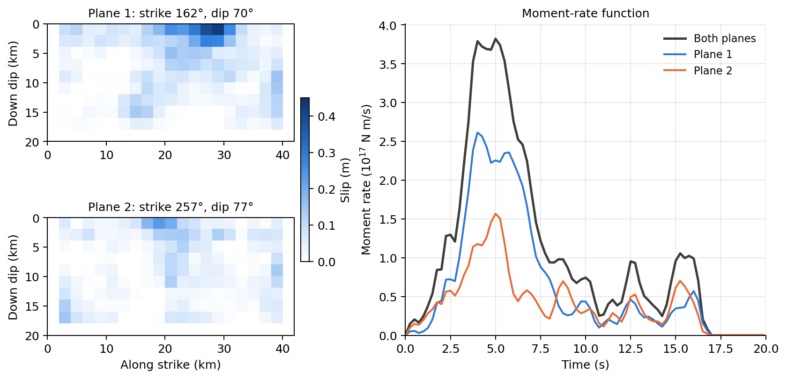
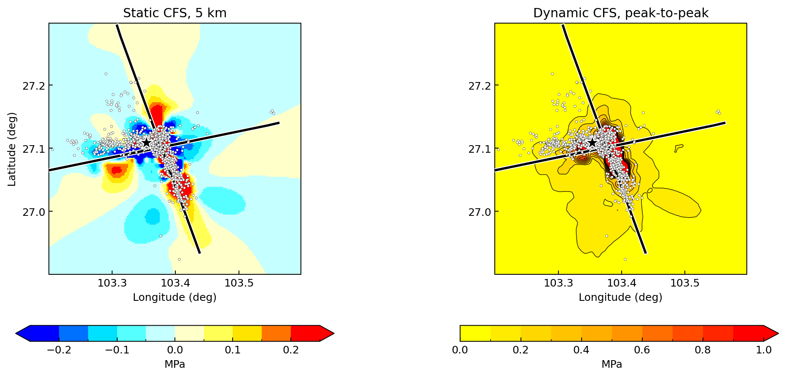

# Ludian earthquake

This example uses a finite-fault model of the 3 August 2014 Ludian
earthquake in Yunnan. The model has two intersecting source planes with a
total scalar moment of 2.13 × 10¹⁸ N m (Mw 6.15). The example computes
static and dynamic Coulomb stress changes on optimally oriented planes at
5 km depth and plots them with the aftershock catalog.

The input data and the original scripts are in `examples/ludian/`.

## Input model



Distance along strike starts at the first row of each CSV file; distance
down dip starts at the top edge. About three quarters of the moment is
released in the first 8 s, with later pulses at about 12.5 and 15.5 s.
Plane 1 carries the larger slip.

| Plane | Patches (strike × dip) | Patch size | Strike | Dip | Depth | Peak slip |
|---|---|---|---|---|---|---|
| 1 | 21 × 10 | 2 × 2 km | 162° | 70° | 0.9–17.9 km | 0.43 m |
| 2 | 21 × 10 | 2 × 2 km | 257° | 77° | 1.0–18.5 km | 0.23 m |

Rake varies patch by patch. Each patch has a 160-sample source time
function at 0.125 s. The Earth model is `input/model.nd`.
`after_ludian.txt` lists 976 events from 3 to 19 August 2014 as longitude,
latitude, depth and magnitude; `after_time.txt` gives their times.

## Calculation settings

| Setting | Value |
|---|---|
| Sources | Planes 1 and 2 (420 patches); slip below 0.1 m is ignored (`slip_thresh = 0.1`) |
| Receivers | 5 km depth; latitude 26.9–27.3°, longitude 103.2–103.6°, 0.01° spacing (41 × 41 points) |
| Receiver orientation | Optimally oriented planes (`optimal_type = 2`) |
| Regional stress axes (azimuth / plunge) | Most compressive 130.60° / 4.63°; intermediate 16° / 79°; least compressive 221.41° / 9.96° |
| Friction / Skempton coefficient | 0.6 / 0.75 |
| Static library | Source depths 1–20 km (0.5 km), distances 0.25–150 km (0.25 km) |
| Dynamic library (QSEIS2025) | Source depths 1–20 km and receiver depths 0.25–20.25 km (0.5 km); distances 0.25–150 km (0.25 km) |
| Time sampling | STF and CFS at 0.125 s; 1024 samples (0–127.875 s) |

With a nonzero Skempton coefficient, CFS includes the mean-stress term:

```{math}
\Delta CFS = \Delta\tau + \mu_f(\Delta\sigma_n - B\,\Delta\sigma_m).
```

The regional stress axes set the orientation of the optimal planes; the
reported CFS is the stress change caused by the earthquake. See the
[receiver modes](../conventions.md#receiver-modes) for details.

Receiver depths in the library are 0.25, 0.75, … km. The static reader
takes the nearest depth, **4.75 km**, for the requested 5 km. Dynamic
synthesis interpolates between 4.75 and 5.25 km. Some patches of both planes
are shallower than the 1 km library limit; their queries use the 1 km
boundary.

## Results



The left panel shows static CFS on a −0.25 to +0.25 MPa scale with
0.05 MPa bins. The right panel shows the peak-to-peak dynamic CFS on a
0–1 MPa scale with 0.1 MPa bins and contours:

```{math}
\max\bigl(0,\max_t\Delta CFS(t)\bigr)-\min\bigl(0,\min_t\Delta CFS(t)\bigr).
```

Black lines mark where the planes cross 5 km depth. White dots are the
catalog events; the star is the first event, the mainshock. The panels are
displayed with fivefold bilinear interpolation of the 41 × 41 grid.

Static CFS ranges from −4.17 to 7.48 MPa. Dynamic CFS ranges from −6.82
to 25.00 MPa over the time series, and its peak-to-peak value from
0.016 to 25.03 MPa. Positive static CFS covers 36% of the map, and 60% of
the 967 events inside the map fall there. Peak-to-peak dynamic CFS of at
least 0.1 MPa covers 18% of the map and 87% of those events. The maps are
at 5 km, whereas the median event depth is 9.7 km, so these fractions only
describe the map-view pattern.

## Run the example

The documentation runner copies the inputs, sets absolute paths in a copy
of the INI and writes everything to `docs/_build/cases/ludian/`. Run it
from the repository root:

```powershell
conda run -n pygrnwang python docs/examples/run_case_studies.py --case ludian
conda run -n pygrnwang python docs/examples/plot_case_inputs.py
conda run -n pygrnwang python docs/examples/plot_case_studies.py --figure ludian
```

The calculation needs EDGRN2, EDCMP2, QSEIS2025 and Java/TauP. The runner
has three stages: `--stage static`, `--stage dynamic-library` and
`--stage dynamic`. A completed stage is skipped; add `--force-stage` to
repeat it. Use a new `--output-dir` after changing inputs. With 12 worker
processes, the stages took about 20 s, 12 min and 9.5 min. The runner
builds only the library depths and distance groups that the receivers
query.

The original scripts can also be run directly:

| File | Purpose |
|---|---|
| `compute_static_and_dynamic_cfs_fix_depth.py` | Build both libraries and compute static and dynamic CFS at 5 km |
| `plot_compare_cfs_oop_fix_dep.py` | Plot static and peak-to-peak dynamic CFS with aftershocks |

Replace the `/e/dyncfs_data/` paths in `ludian.ini` first. The script
reads `ludian.ini` from the current directory and runs dynamic synthesis
in parallel; keep its `if __name__ == "__main__":` guard (see
[parallel runs](../guides/parallel.md)). The original plotting script
computes the grid size with an unrounded `ceil`, which can give 42 points
instead of 41; `plot_case_studies.py` uses `cal_grid_num` instead.

## Output files

Under `docs/_build/cases/ludian/results/`:

| Path | Content |
|---|---|
| `static/cfs_oop_static_dep_5.00.csv` | Static CFS, 1681 values (Pa) |
| `static/stress_tensor_dep_5.00.npy` | Static stress tensor, (1681, 6), NED components (Pa) |
| `dynamic/cfs_oop_dynamic_dep_5.00.csv` | Dynamic CFS, 1681 rows × 1024 samples (Pa) |

Grid points are ordered with longitude varying fastest. Normal vectors,
slip directions and normal and shear stresses are saved for both
conjugate planes; the CFS files use the second plane. `run.json` records
input hashes, program versions, stage timings and result statistics.
