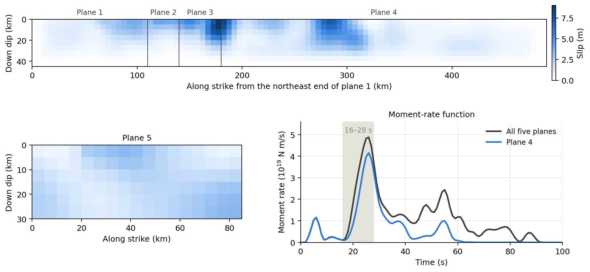
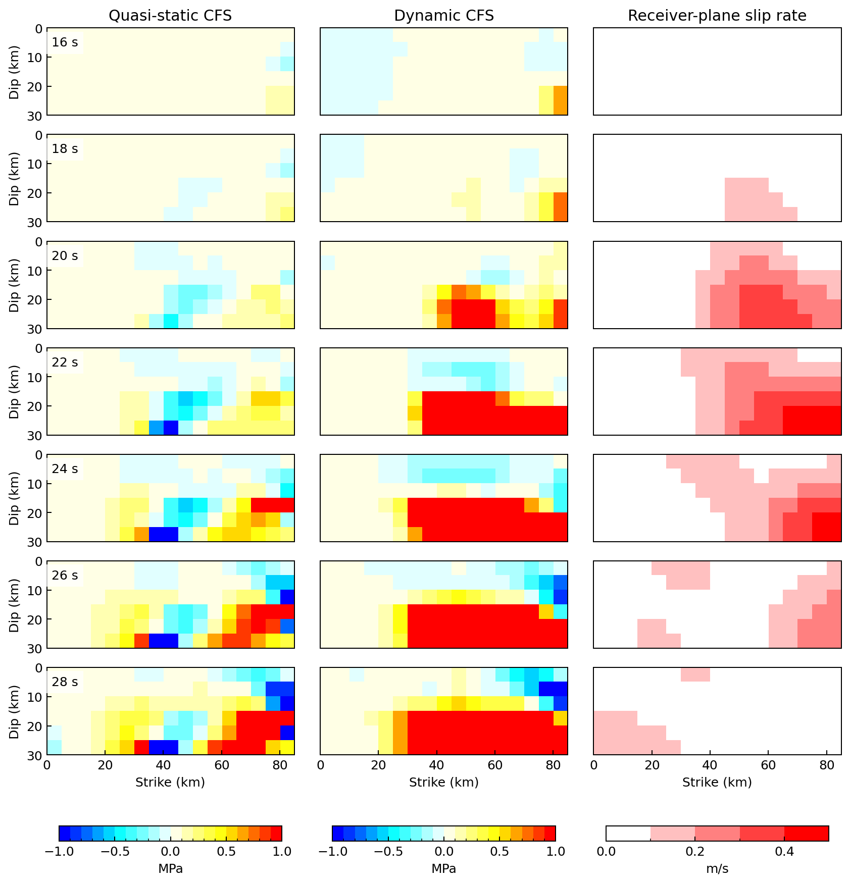
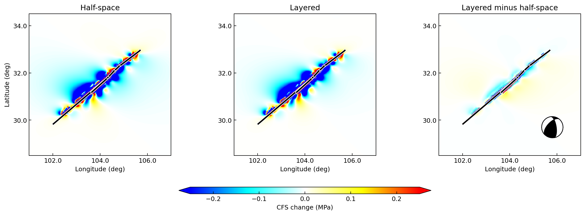

# Wenchuan earthquake

This example uses a finite-fault model of the 2008 Wenchuan earthquake.
The model has five source planes with a total scalar moment of
1.04 × 10²¹ N m (Mw 7.95). It runs two calculations:

1. **Stress history on a receiver fault.** Source plane 4 loads plane 5.
   The example computes quasi-static and dynamic CFS as the rupture grows.
2. **Static CFS map at 15 km depth.** All five planes load a geographic
   grid. The map is computed in a layered model and in a homogeneous
   half-space.

The input data and the original scripts are in `examples/wenchuan/`.

## Input model



Planes 1–4 lie end to end along strike and share the same depth range.
The top panel shows them from the northeast end of plane 1, with
distance measured down dip from the top edge. Plane 5 is a separate,
shallower fault. The moment-rate function combines all five planes;
plane 4 dominates the main pulse between about 16 and 28 s.

| Plane | Patches (strike × dip) | Patch size | Strike | Dip | Peak slip |
|---|---|---|---|---|---|
| 1 | 22 × 9 | 5 × 5 km | 228° | 10–40° | 4.07 m |
| 2 | 6 × 9 | 5 × 5 km | 223° | 10–40° | 4.23 m |
| 3 | 8 × 9 | 5 × 5 km | 218° | 10–40° | 9.03 m |
| 4 | 62 × 9 | 5 × 5 km | 225° | 10–40° | 8.31 m |
| 5 | 17 × 6 | 5 × 5 km | 223° | 25–65° | 3.53 m |

Dip varies with depth on every plane. Rake varies patch by patch, and each
patch has a 240-sample source time function at 0.5 s. `obs_plane5.csv`
repeats the geometry of plane 5 and supplies a receiver rake for each cell.
The Earth model is `input/model.nd`.

## Stress history on plane 5

| Setting | Value |
|---|---|
| Source | Plane 4 only; patches with slip below 1 m are ignored (`slip_thresh = 1`) |
| Receiver | Plane 5, 17 × 6 cells, mechanism of each cell from `obs_plane5.csv` |
| Friction / Skempton coefficient | 0.4 / 0 |
| Static library | Source depths 1–31 km (2 km), distances 0–800 km (2 km) |
| Dynamic library (QSEIS2025) | Source depths 1–31 km and receiver depths 0–32 km (2 km); distances 2–1000 km (2 km) |
| Time sampling | STF and CFS at 0.5 s; 1024 samples (0–511.5 s) |

Quasi-static CFS at time *t* uses the slip accumulated up to *t*: it keeps
the first `cut_stf = 2t` STF samples (`cut_stf = 0` means the final slip).
Dynamic CFS includes the transient seismic waves.



Each row is one time between 16 and 28 s. The two CFS columns share the
−1 to +1 MPa scale with 0.1 MPa bins. The right column shows the slip rate
of plane 5 from its own input source time function. Plane 5 is not a
source in this calculation; the column shows when that fault slipped.

Dynamic CFS rises faster than quasi-static CFS. On the lower half of
plane 5 (more than 15 km down dip), dynamic CFS exceeds +1 MPa on about
half of the cells from 22 s. Quasi-static CFS exceeds +1 MPa on at most
16% of those cells by 28 s. In this window, slip rate on plane 5 first
exceeds 0.1 m/s at 18 s. Final static CFS on plane 5 ranges from −5.58 to
3.91 MPa. Dynamic CFS ranges from −2.97 to 26.42 MPa over the full time
series.

## Static CFS map at 15 km

| Setting | Value |
|---|---|
| Sources | Planes 1–5 (984 patches), `slip_thresh = 1` |
| Receivers | 15 km depth; latitude 28.5–34.5°, longitude 101–107°, 0.01° spacing (601 × 601 points) |
| Receiver mechanism | Strike 223°, dip 47°, rake 131° |
| Friction / Skempton coefficient | 0.4 / 0 |
| Static libraries | Source depths 0–30 km (1 km), distances 0–1000 km (1 km), receiver depth 15 km |
| Half-space elasticity | λ = 25.21168 GPa, μ = 31.12616 GPa |



All three panels use ±0.25 MPa; stronger values are saturated. The black
line marks where the source planes cross 15 km depth. The half-space and
layered maps show the same pattern of positive and negative lobes. Their
difference is concentrated next to the fault: more than 25 km from the
nearest source patch it stays below 0.04 MPa, and beyond 100 km below
0.015 MPa. Map CFS ranges from −768.5 to 352.5 MPa in the half-space and
from −781.6 to 332.1 MPa in the layered model. These extremes lie within
about 1 km of a source patch.

## Run the example

The documentation runner copies the inputs, sets absolute paths in a copy
of the INI and writes everything to `docs/_build/cases/wenchuan/`. Run it
from the repository root:

```powershell
conda run -n pygrnwang python docs/examples/run_case_studies.py --case wenchuan
conda run -n pygrnwang python docs/examples/plot_case_inputs.py
conda run -n pygrnwang python docs/examples/plot_case_studies.py --figure wenchuan-plane
conda run -n pygrnwang python docs/examples/plot_case_studies.py --figure wenchuan-static
```

The calculation needs EDGRN2, EDCMP2, QSEIS2025 and Java/TauP. The runner
has three stages: `--stage static`, `--stage dynamic-library` and
`--stage dynamic`. A completed stage is skipped; add `--force-stage` to
repeat it. Use a new `--output-dir` after changing inputs or grid spacing.
With 12 worker processes, the stages took about 7 min, 2 h and 30 s.
The runner builds only the library depths and distance groups that the
receivers query, so its libraries are smaller than the INI ranges.

The original scripts can also be run directly. First replace the
`/e/dyncfs_data/` paths in `wenchuan.ini`.

| Script | Purpose |
|---|---|
| `compute_cfs_static_along_time.py` | Static library and quasi-static CFS on plane 5 for `cut_stf = 0, 2, …, 78` |
| `compute_dynamic_cfs.py` | Dynamic library and dynamic CFS on plane 5 |
| `compute_static_cfs_fix_depth.py` | Layered static map at 15 km |
| `compute_cfs_static_half_space_fix_depth.py` | Half-space static map at 15 km |
| `plot_plane5_compare_2d.py`, `plot_compare_static_cfs_fix_dep.py` | Plot the two calculations |
| `plot_slip_3d_wenchuan.py` | 3D slip view; also reads `stf.npy`, which is not included |
| `create_coulomb3.py` | Export the sources to a Coulomb 3 input file |

Before running the original map scripts, note:

- `wenchuan.ini` selects source plane 4. The map scripts switch to planes
  1–5 in code.
- The map scripts set the grid spacing to 0.05°, while the INI uses 0.01°.
  The figures above use 0.01°.
- `source_shapes` in the map scripts has one extra level of nesting.
  Write it as `[[22, 9], [6, 9], [8, 9], [62, 9], [17, 6]]`.
- `create_static_lib` is commented out in the layered map script, and the
  half-space script never builds a library. Build a library with matching
  `layered`, `lam` and `mu` settings before computing.
- The half-space script reads its INI from an absolute path; change it
  to your copy of `wenchuan.ini`.
- The full map has 361 201 receivers. Start with a coarser grid when
  testing.

`create_coulomb3.py` converts the selected geometry for Coulomb 3.
It writes the input file but does not run Coulomb 3.

## Output files

Under `docs/_build/cases/wenchuan/results/`:

| Path | Content |
|---|---|
| `static/cfs_static_plane5.csv` | Final static CFS on the 102 cells of plane 5 (Pa) |
| `static/time/<cut_stf>/cfs_static_plane5.csv` | Quasi-static CFS for each STF cutoff |
| `dynamic/cfs_dynamic_plane5.csv` | Dynamic CFS, 102 rows × 1024 samples (Pa) |
| `static_layer/`, `static_half/` | Maps at 15 km: `cfs_static_dep_15.00.csv` and the stress tensor `stress_tensor_dep_15.00.npy` |

Each map CSV has one value per grid point, with longitude varying fastest.
`run.json` records input hashes, program versions, stage timings and
result statistics.
